# ERD — EGTO Gestion Commerciale (périmètre MVP)

Jalon 0. Vue logique des tables de `electron/db/schema.sql`, dérivée des entités de [prd-cda.md](../prd-cda.md) §10.1. Les entités hors MVP (déclarations, ST, cautions, encaissements, sous-traitance, retenues, registre des consultations) ne figurent pas ici — voir `matrice-tracabilite-champs.md` pour leur phase cible.

## Conventions de lecture

- `statut` et les colonnes transversales (`cree_le`, `modifie_le`, `supprime_le`) ne sont pas répétés sur chaque entité.
- Toutes les FKs sont nommées `<cible>_id` sauf indication contraire.
- `affaires.id` ↔ `affaires.affaire_mere_id` est une auto-référence (avenants).

```mermaid
erDiagram
    familles ||--o{ sous_familles : "regroupe"
    sous_familles ||--o| classifications : "classifie"
    sous_familles ||--o{ produits : "détaille"
    familles ||--o{ produits : "regroupe"
    clients ||--o{ contacts : "a"
    clients ||--o{ interactions : "a"
    clients ||--o{ affaires : "signe"
    clients ||--o{ devis : "reçoit"
    clients ||--o{ factures : "concerne"
    clients ||--o{ bons_livraison : "reçoit"

    affaires ||--o{ affaires : "avenant de"
    affaires ||--o{ evenements_delais : "suit"
    affaires ||--o{ avenants : "modifié par"
    affaires ||--o{ postes_dqe : "contient"
    affaires ||--o{ attachements : "justifie"
    affaires ||--o{ receptions : "clôture par"
    affaires ||--o{ correspondances : "échange"
    affaires ||--o{ factures : "facturé par"
    affaires ||--o{ bons_livraison : "livre"
    affaires ||--o{ tarifs_historique : "tarifie (niveau AFFAIRE)"
    affaires ||--o{ compteurs_numerotation : "numérote (ST)"

    produits ||--o{ lignes_devis : "ligne"
    produits ||--o{ lignes_facture : "ligne"
    produits ||--o{ lignes_bon_livraison : "ligne"
    produits ||--o{ tarifs_historique : "tarif"

    devis ||--o{ lignes_devis : "contient"
    devis o|--o| affaires : "converti en"
    affaires ||--o{ postes_dqe : "reprend les lignes"
    lignes_devis o|--o| postes_dqe : "trace la conversion"

    avenants ||--o{ avenants_postes : "impacte"
    avenants_postes o|--o| postes_dqe : "modifie/supprime"
    attachements ||--o{ attachements_postes : "constate"
    attachements_postes }o--|| postes_dqe : "concerne"

    factures ||--o{ lignes_facture : "contient"
    factures o|--o| factures : "avoir de (origine)"
    bons_livraison ||--o{ lignes_bon_livraison : "contient"
    bons_livraison }o--o| factures : "facturé par"

    exercices ||--o{ devis : "année"
    exercices ||--o{ factures : "année"
    exercices ||--o{ bons_livraison : "année"

    familles {
        int id PK
        string code UK
        string libelle
    }
    sous_familles {
        int id PK
        int famille_id FK
        string code UK
        string libelle
    }
    classifications {
        int id PK
        int sous_famille_id FK
        string categorie "NOIR|BLANC|AUTRE"
    }
    clients {
        int id PK
        string code_client UK "CLI-YYYY-NNNNN"
        string type_client "EPE_SPA|SARL|EURL|ETP|ETBH|PARTICULIER"
        string categorie "PUBLIC|PRIVE"
        string nif "15 chiffres, unique hors particuliers"
        string nis
        string statut "PROSPECT|ACTIF|INACTIF|EN_VIGILANCE|ARCHIVE"
        string score_client "A|B|C|D, calculé"
    }
    contacts {
        int id PK
        int client_id FK
        string nom
    }
    interactions {
        int id PK
        int client_id FK
        string type_interaction "APPEL|VISITE|RELANCE|AUTRE"
    }
    produits {
        int id PK
        string code_produit UK
        int famille_id FK
        int sous_famille_id FK
        string unite "T|M2|M3|FORFAIT|H|J|KM|U|L"
        int pu_reference_centimes
    }
    affaires {
        int id PK
        string reference UK "AFG-YYYY-NNNNN"
        string type_affaire "MARCHE_PUBLIC|CONTRAT_PRIVE|BC|AVENANT"
        int affaire_mere_id FK "si avenant"
        int client_id FK
        string statut "SIGNE|ODS_RECU|EN_COURS|FACTURE|SOLDE|ARCHIVE|RESILIE"
        int montant_initial_ht_centimes
        int retenue_garantie_bps "défaut 500 (5 % base HT)"
    }
    evenements_delais {
        int id PK
        int affaire_id FK
        string type_evenement "ODS|SUSPENSION|REPRISE|PROROGATION"
        int impact_delai_jours
    }
    avenants {
        int id PK
        string numero UK "AVT-YYYY-NNNNN"
        int affaire_id FK
        string statut "BROUILLON|VALIDE"
        int impact_montant_ht_centimes
    }
    avenants_postes {
        int id PK
        int avenant_id FK
        string action "AJOUT|MODIFICATION|SUPPRESSION"
        int poste_dqe_id FK
    }
    postes_dqe {
        int id PK
        int affaire_id FK
        int numero
        int quantite_milliemes
        int pu_ht_centimes
        string classification "NOIR|BLANC|AUTRE, snapshot"
        string origine "DEVIS|IMPORT|AVENANT|MANUEL"
        int ligne_devis_id FK
    }
    attachements {
        int id PK
        string numero_attachement UK "ATT-<affaire>-NNN"
        int affaire_id FK
        string statut "BROUILLON|SIGNE|REPORTE_DECLARATION"
    }
    attachements_postes {
        int id PK
        int attachement_id FK
        int poste_dqe_id FK
        int quantite_constatee_milliemes
    }
    receptions {
        int id PK
        int affaire_id FK
        string type_reception "PROVISOIRE|DEFINITIVE"
    }
    correspondances {
        int id PK
        int affaire_id FK
        string type_correspondance "COURRIER_SORTANT|COURRIER_ENTRANT|DEMANDE_PROROGATION|RECLAMATION|MISE_EN_DEMEURE|AUTRE"
    }
    devis {
        int id PK
        string numero_devis UK "DEV-YYYY-NNNNN"
        int client_id FK
        string statut "BROUILLON|ENVOYE|ACCEPTE|REFUSE|EXPIRE"
        int affaire_id FK "si converti"
        int exercice_id FK
    }
    lignes_devis {
        int id PK
        int devis_id FK
        int produit_id FK
        int quantite_milliemes
        int pu_ht_centimes
    }
    factures {
        int id PK
        string type_document "FA|AC|AV|FS|ND"
        string numero "NULL tant que non validée"
        int affaire_id FK "nullable"
        int client_id FK
        string statut "BROUILLON|VALIDE|IMPRIMEE|ENVOYEE|PAYEE|ARCHIVEE"
        int facture_origine_id FK "si AV"
        int interets_moratoires_centimes "ND, montant saisi directement"
        int net_a_payer_centimes
        int exercice_id FK
    }
    lignes_facture {
        int id PK
        int facture_id FK
        int produit_id FK
        int quantite_milliemes
        int pu_ht_centimes
        string classification "snapshot"
    }
    bons_livraison {
        int id PK
        string numero_bl UK "BL-YYYY-NNNNN"
        int affaire_id FK "nullable"
        int client_id FK
        string statut "EMIS|FACTURE"
        int facture_id FK "si facturé"
        int exercice_id FK
    }
    lignes_bon_livraison {
        int id PK
        int bon_livraison_id FK
        int produit_id FK
        int quantite_milliemes
    }
    tarifs_historique {
        int id PK
        int produit_id FK
        string type_niveau "CATALOGUE|CLIENT|AFFAIRE"
        int client_id FK
        int affaire_id FK
        int prix_centimes
        string debut_periode
        string fin_periode
    }
    exercices {
        int id PK
        int annee UK
        string statut "OUVERT|CLOTURE"
    }
    compteurs_numerotation {
        int id PK
        string code_document "FA|ST|DEV|BL|CLI|..."
        int annee
        int affaire_id FK "ST par marché"
        int dernier_numero
    }
    parametres {
        int id PK
        string cle UK
        string valeur
    }
    bareme_timbre {
        int id PK
        int borne_min_ttc_centimes
        int borne_max_ttc_centimes "NULL = ouvert"
        int taux_bps
        int plancher_centimes
        int plafond_centimes
    }
    journal_audit {
        int id PK
        string table_affectee
        string action "INSERT|UPDATE|DELETE"
        int ligne_id
        string ancien_etat "JSON"
        string nouvel_etat "JSON"
    }
```

## Note de validation

ERD **relu et validé par le service commercial EGTO** (09/08/2026 — DoD J0 ✅). La maquette haute fidélité (`../mockup.html`) est l'illustration attendue du comportement, cet ERD est la validation de la structure.
